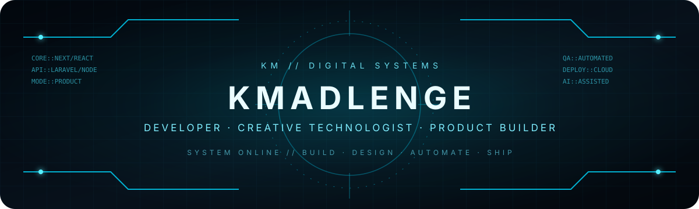

<div align="center">
  
</div>

<div align="center">

# @kmadlenge-collab

**Developer · Creative Technologist · Digital Product Builder**

I build practical digital products where **design, software, AI and business** meet — from client platforms and media products to learning systems and community technology.

[Portfolio](https://milkcybercreatives.co.za/) · [GitHub](https://github.com/kmadlenge-collab) · [Start a project](https://milkcybercreatives.co.za/contact)

</div>

```text
SYSTEM STATUS  : ONLINE
PRIMARY MODE   : BUILD · DESIGN · AUTOMATE · SHIP
CORE FOCUS     : WEB PLATFORMS · AI-ASSISTED PRODUCTS · UX · DIGITAL GROWTH
OPERATING BASE : SOUTH AFRICA
```

## Current build queue

- **WRTNG CODES Academy** — an AI-first learning platform for practical digital skills, with learner, instructor and admin experiences, curriculum validation and hands-on practice workflows.
- **Ama FANS Wethu TV** — a video-first football media platform with searchable content, YouTube ingestion, structured SEO, curation tools and monetisation-ready architecture.
- **Mayibuye Youth Activism Movement** — an organisational publishing platform using a Laravel administration layer and a Next.js public experience.
- I continue to improve production websites, internal tools and customer-facing systems through **Milk Cyber Creatives**.

## Selected systems & products

| Project | What I built / improved | Core technology | Access |
| --- | --- | --- | --- |
| **WRTNG CODES Academy** | AI-first digital-skills learning platform with role-based workspaces, practical course experiences, curriculum checks and a Laravel API runtime. | Next.js, React, TypeScript, Laravel, Playwright | Private product build |
| **Ama FANS Wethu TV** | Football media experience with video hubs, search, curation, structured data, RSS, sitemap support and advertising-ready surfaces. | Next.js, TypeScript, Tailwind CSS, Redis-compatible services | Private product build |
| **Mayibuye Youth Activism Movement** | Publishing architecture where administrators manage approved content in Laravel and the public website consumes it through an API. | Next.js, React, TypeScript, Laravel, MySQL | Private organisational build |
| **Famous Cleaning Services** | Production service website with conversion-focused journeys, SEO foundations, structured data and analytics/ads integration points. | Next.js, React, TypeScript | [Visit live site](https://www.famouscleaning.co.za/) |
| **The Giiving Network** | Community-impact platform supporting programmes, events, giving and participation journeys. | React, TypeScript, Vite, Firebase | [Visit live site](https://www.thegiivingnetwork.org/) |
| **Milk Cyber Creatives** | Creative and digital agency platform presenting services, portfolio work, products and client enquiry journeys. | Modern web stack, UI/UX, digital strategy | [Visit portfolio](https://milkcybercreatives.co.za/) |

## Technology matrix

**Languages**  
<kbd>TypeScript</kbd> <kbd>JavaScript</kbd> <kbd>PHP</kbd> <kbd>HTML</kbd> <kbd>CSS</kbd>

**Frontend**  
<kbd>Next.js</kbd> <kbd>React</kbd> <kbd>Tailwind CSS</kbd> <kbd>Vite</kbd> <kbd>Responsive UI</kbd> <kbd>Accessibility</kbd>

**Backend & data**  
<kbd>Laravel</kbd> <kbd>Node.js</kbd> <kbd>Express</kbd> <kbd>MySQL</kbd> <kbd>Firebase</kbd> <kbd>Redis</kbd> <kbd>REST APIs</kbd>

**Quality & delivery**  
<kbd>Git</kbd> <kbd>GitHub</kbd> <kbd>Vercel</kbd> <kbd>Playwright</kbd> <kbd>ESLint</kbd> <kbd>TypeScript checks</kbd> <kbd>SEO</kbd> <kbd>Structured Data</kbd>

**AI & product workflow**  
<kbd>AI-assisted development</kbd> <kbd>Generative AI integrations</kbd> <kbd>Automation</kbd> <kbd>Rapid prototyping</kbd> <kbd>Product iteration</kbd>

## How I work

I like software that earns its complexity. My focus is on shipping interfaces that are clear to users, maintainable for the team behind them, and connected to real business or community outcomes.

```text
01  DISCOVER   Understand the user, business and operating constraints.
02  DESIGN     Make the structure, hierarchy and interactions feel obvious.
03  BUILD      Choose a stack that fits the product instead of chasing trends.
04  VALIDATE   Test functionality, responsiveness, accessibility and edge cases.
05  SHIP       Deploy, observe, improve and keep the product maintainable.
```

## What I care about

I am especially interested in **AI-assisted products, education technology, digital media, community platforms, business systems, search visibility, e-commerce and conversion-focused web experiences**.

The common thread is simple: technology should make something **clearer, faster, easier to operate or more useful to people**.

## Collaboration channel

I’m open to conversations around product development, client platforms, modernising existing systems, AI-assisted workflows and practical digital transformation.

- **Portfolio:** https://milkcybercreatives.co.za/
- **Project enquiries:** https://milkcybercreatives.co.za/contact
- **GitHub:** https://github.com/kmadlenge-collab

<div align="center">
  <sub>KM SYSTEM // BUILD WITH PURPOSE // ITERATE WITH EVIDENCE</sub>
</div>
